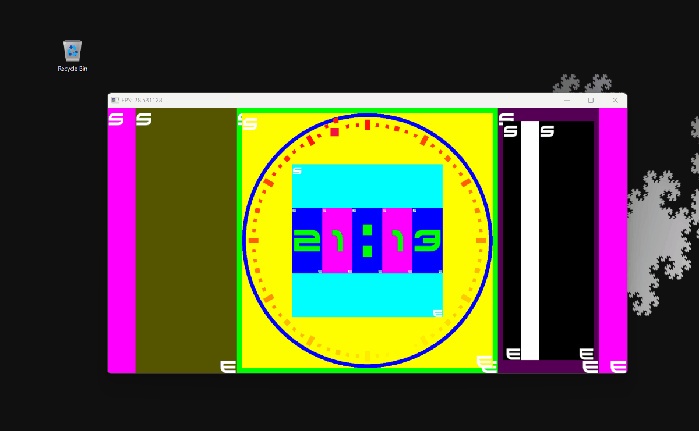

# Project Clock/Game

## Project Overview
This project is an unfinished C++ application built with SFML (Simple and Fast Multimedia Library). 

Initial idea was learning SFML by reimagining a game I made in python years ago.
Although the project didn't reach completion due to loss of interest, it achieved its goal of familiarizing me with the library.
One notable achievement was the development of a robust layout system that allows the application to scale properly to any screen size.
Might reuse or iterate on the ideas explored here in later projects.

## Clock/Game 

## Layout Debug View Mode

## License
This project is provided under [appropriate license]. Please refer to the LICENSE file in the repository for more details.